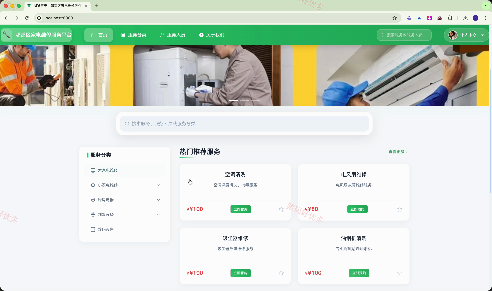
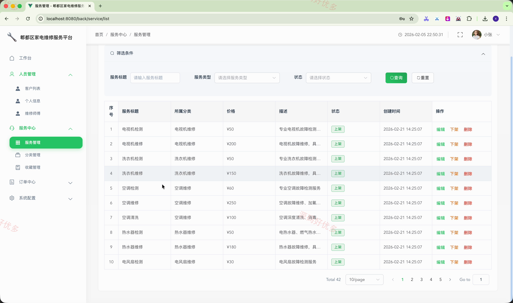
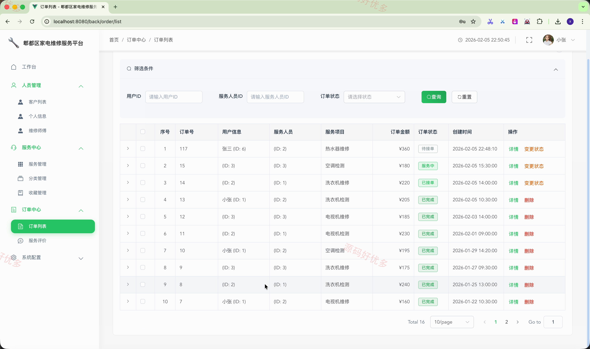

# springbootA685D-
springbootA685D 家电维修服务平台
## 源码问题查看主页咨询

### 一、关键词
家电维修服务、维修预约、服务项目、维修师傅、工单管理

### 二、作品包含
源码+数据库+万字设计文档+全套环境和工具资源+本地部署教程

### 三、项目技术
前端技术： Html、Css、Js、Vue3.2、Element-Plus
后端技术：Java、SpringBoot3.2.0、MyBatis-Plus

### 四、运行环境（以下版本亲测，其他版本兼容性请自行测试）
开发工具：IDEA/eclipse + VSCODE

数据库：MySQL5.7+（共15张表）

数据库管理工具：Navicat10以上版本

环境配置软件： JDK17 + Maven3.6.3

前端Nodejs：16+

浏览器：谷歌浏览器

### 五、项目介绍
项目编号：springbootA685D

家电维修服务平台面向用户、维修师傅和管理员，围绕家电维修服务展示、在线预约、订单处理、评价沟通及后台运营管理提供完整业务流程。

角色：用户、维修师傅、管理员

用户功能：注册登录与个人资料维护、家电维修服务分类与服务项目浏览、维修师傅信息查看、维修预约下单与订单查询、服务评价与收藏、浏览历史与在线聊天。

维修师傅功能：后台登录与个人信息维护、维修订单查看与处理、客户沟通与聊天消息处理、服务评价查看。

管理员功能：用户与维修师傅管理、服务项目与分类管理、预约订单与服务评价管理、角色权限与菜单配置、轮播图和聊天消息管理。

### 六、运行截图

